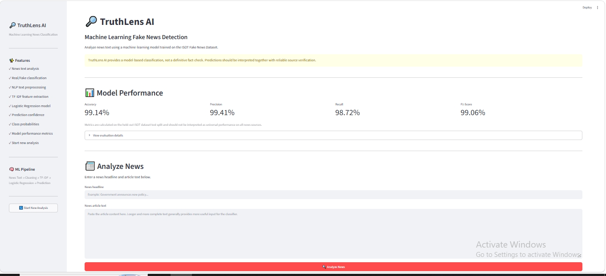
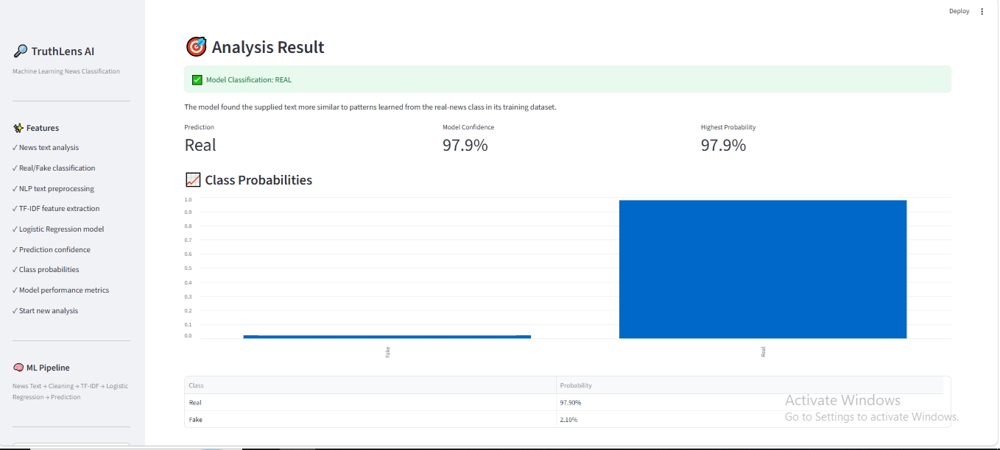
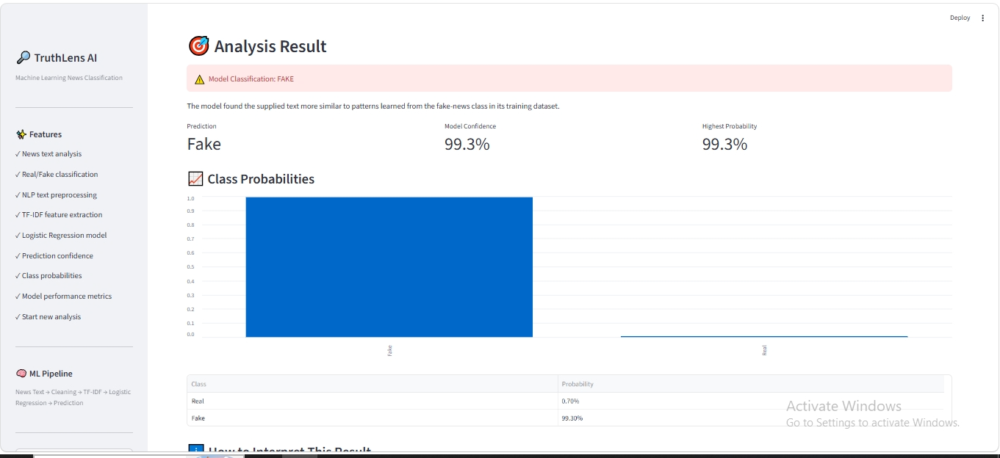
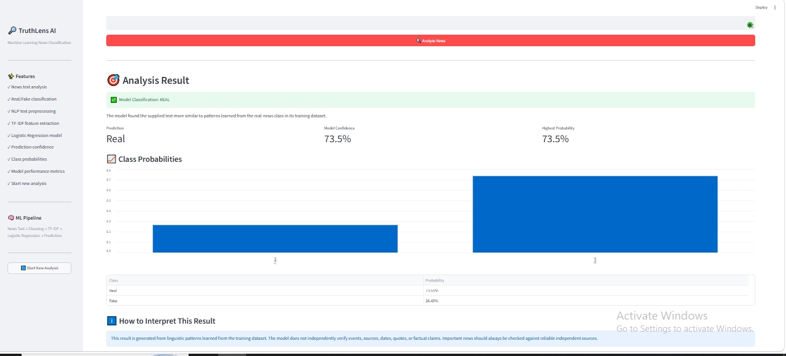
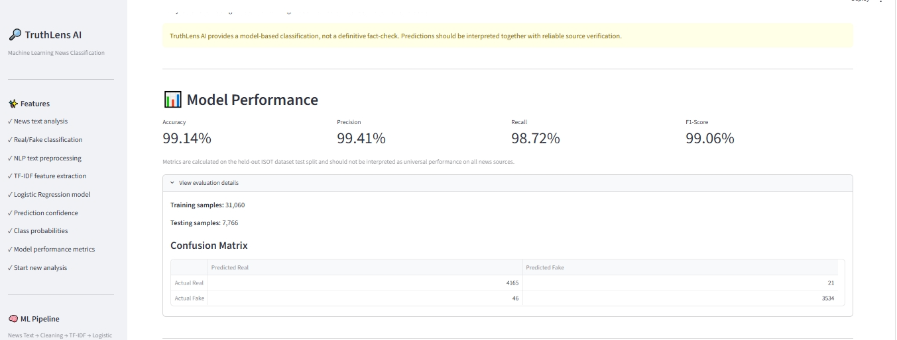

# 🔎 TruthLens AI

## Machine Learning Fake News Detection

TruthLens AI is a machine-learning application that classifies news text as **Real** or **Fake** using Natural Language Processing (NLP), TF-IDF feature extraction, and Logistic Regression.

The project was developed as part of an Artificial Intelligence internship with **SAM AI Technologies**.

---

## 🚀 Features

- 📰 Analyze a news headline and article text
- 🧹 NLP-based text cleaning and normalization
- 🔠 TF-IDF feature extraction with unigram and bigram features
- 🤖 Logistic Regression classification
- ✅ Real/Fake prediction
- 📊 Prediction confidence
- 📈 Real and Fake class probabilities
- 📋 Model evaluation metrics
- 🧮 Confusion matrix
- 🔄 Start a new analysis without restarting the application
- 🖥️ Clean Streamlit interface
- ⚠️ Responsible-use guidance explaining that predictions are not definitive fact-checks

---

## 🖼️ Application Screenshots

### TruthLens AI Home and Model Performance



### Real News Prediction



### Fake News Prediction



### Neutral / Custom News Example



### Evaluation Details



---

## 🎯 Project Objective

The purpose of TruthLens AI is to demonstrate a complete machine-learning workflow for text classification.

The application allows users to:

1. Enter a news headline and article text.
2. Clean and normalize the supplied text.
3. Convert the text into numerical TF-IDF features.
4. Classify the text using a trained Logistic Regression model.
5. Display the predicted class as Real or Fake.
6. Show the model confidence and class probabilities.
7. Review held-out test-set performance metrics.
8. Start a fresh analysis without restarting the application.

---

## 🧠 Machine Learning Pipeline

```text
News Headline + Article
        ↓
Text Cleaning
        ↓
TF-IDF Feature Extraction
        ↓
Logistic Regression
        ↓
Real / Fake Classification
        ↓
Confidence + Class Probabilities
```

---

## 🛠️ Technologies Used

- Python
- Streamlit
- pandas
- NumPy
- scikit-learn
- joblib
- Matplotlib
- NLTK

---

## 📚 Dataset

TruthLens AI was trained using the **ISOT Fake News Dataset**.

### Label Mapping

```text
0 = Real
1 = Fake
```

After preprocessing and exact-duplicate removal, the working dataset contained:

```text
Total records : 38,826
Real articles : 20,926
Fake articles : 17,900
```

The dataset was split into training and testing subsets using an 80/20 stratified split:

```text
Training samples : 31,060
Testing samples  : 7,766
```

---

## 🧹 Text Preprocessing

Before model training and prediction, text is normalized through the following steps:

- Convert text to lowercase
- Remove URLs
- Remove HTML-like tags
- Remove non-alphabetic characters
- Remove extra whitespace
- Combine the article title and body
- Remove empty records
- Remove exact duplicate cleaned articles

The same preprocessing function is applied to both training data and new user input.

---

## 🔠 TF-IDF Feature Extraction

TruthLens AI uses `TfidfVectorizer` to convert cleaned text into numerical features.

```text
Maximum features : 50,000
N-gram range     : (1, 2)
Minimum document frequency : 2
Maximum document frequency : 0.95
English stop words : enabled
Sublinear TF scaling : enabled
```

---

## 🤖 Classification Model

The classifier uses **Logistic Regression**.

```text
Solver             : liblinear
Maximum iterations : 1000
Class weight        : balanced
Random state        : 42
```

Logistic Regression was selected because it is efficient and well suited to high-dimensional sparse TF-IDF features.

---

## 📊 Model Performance

Performance was measured on the held-out ISOT test split.

```text
Accuracy  : 99.14%
Precision : 99.41%
Recall    : 98.72%
F1-score  : 99.06%
```

### Confusion Matrix

```text
[[4165,   21],
 [  46, 3534]]
```

Interpretation:

- 4,165 real articles were correctly classified as Real.
- 21 real articles were incorrectly classified as Fake.
- 46 fake articles were incorrectly classified as Real.
- 3,534 fake articles were correctly classified as Fake.

> These results describe performance on the held-out ISOT dataset split and should not be interpreted as universal accuracy on all real-world news.

---

## 🧪 Validation Examples

### Test 1 — Known Real Article

```text
Prediction       : Real
Model Confidence : 97.9%
Real Probability : 97.90%
Fake Probability : 2.10%
```

### Test 2 — Known Fake Article

```text
Prediction       : Fake
Model Confidence : 99.3%
Fake Probability : 99.30%
Real Probability : 0.70%
```

### Test 3 — Neutral / Custom Article

```text
Prediction       : Real
Model Confidence : 73.5%
Real Probability : 73.55%
Fake Probability : 26.45%
```

The lower confidence in the neutral example shows that the classifier can be less decisive when text does not strongly resemble one of the learned classes.

---

## ⚠️ Responsible Interpretation

TruthLens AI is a **machine-learning text classifier**, not a complete fact-checking system.

The model:

- does not independently verify events,
- does not confirm whether a source is trustworthy,
- does not browse the web,
- does not verify quotes, dates, images, or claims,
- can be influenced by patterns specific to its training dataset.

Predictions should be treated as model outputs rather than definitive judgments about truth. Important news should always be checked against reliable and independent sources.

---

## 📁 Project Structure

```text
TruthLens_AI/
│
├── app.py
├── README.md
├── requirements.txt
├── .gitignore
│
├── src/
│   ├── preprocess.py
│   └── model.py
│
├── models/
│   ├── truthlens_logistic_regression.pkl
│   ├── truthlens_tfidf_vectorizer.pkl
│   └── truthlens_metrics.pkl
│
├── data/
│   └── News-_dataset/
│       ├── Fake.csv
│       └── True.csv
│
└── assets/
    └── screenshots/
        ├── truthlens-home.png
        ├── real-result.png
        ├── fake-result.png
        ├── neutral-result.png
        └── evaluation-details.png
```

---

## ⚙️ Installation

### 1. Clone the repository

```bash
git clone https://github.com/Kaunaingul-ai/TruthLens-AI.git
```

### 2. Open the project folder

```bash
cd TruthLens-AI
```

### 3. Create a virtual environment

```bash
python -m venv venv
```

### 4. Activate the virtual environment on Windows

```bash
venv\Scripts\activate
```

### 5. Install the dependencies

```bash
pip install -r requirements.txt
```

---

## 🏋️ Train the Model

Place the dataset files at:

```text
data/News-_dataset/Fake.csv
data/News-_dataset/True.csv
```

Then run:

```bash
python -m src.model
```

The training script preprocesses the data, performs an 80/20 stratified split, creates TF-IDF features, trains the classifier, evaluates it, and saves the model artifacts.

---

## ▶️ Run the Application

```bash
streamlit run app.py
```

Then open the local address shown in the terminal, usually:

```text
http://localhost:8501
```

---

## 🔮 Future Improvements

Possible future improvements include:

- comparison of multiple classifiers,
- transformer-based language models,
- explainable predictions,
- URL or source analysis,
- external fact-checking API integration,
- multilingual fake-news detection,
- model calibration,
- dataset-shift testing,
- cloud deployment,
- prediction history and report export.

---

## 📌 Internship Task

This project was developed for the **Fake News Detection** task of the Artificial Intelligence Internship Program at **SAM AI Technologies**.

### Original Task Requirements

The task required:

- Classify news as Real or Fake
- Preprocess text using NLP
- Train and evaluate a machine-learning model
- Display prediction with confidence score
- Show model performance metrics

TruthLens AI satisfies all of these requirements and additionally provides:

- Real/Fake class probabilities
- Confusion matrix
- reusable saved model artifacts
- consistent preprocessing for user input
- responsible-use guidance
- new-analysis workflow
- a polished Streamlit interface

---

## 👩‍💻 Author

**Kaunain Gul Khalid**

BS Artificial Intelligence Student

---

## 📜 License

This project is intended for educational, internship, portfolio, and learning purposes.
